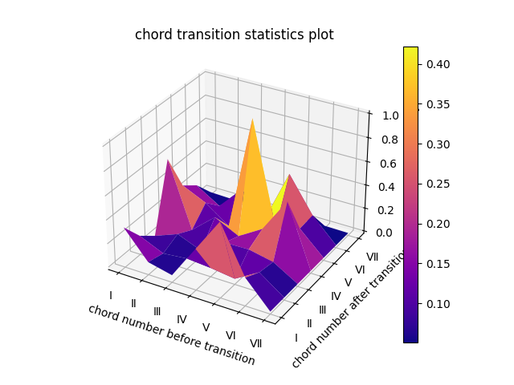

# **�����~�N�֌W�̋Ȃ̃R�[�h�J�ڊm��**
## �R�[�h�J�ڂ̔�d��\�����摜

 

## **�T����̑J�ڊm��**
### **�T : 20.85894313657273��**
### **�U : 9.223394796861106��**
### **�V : 2.1376937647377168��**
### **�W : 38.81093200355638��**
### **�X : 17.476516293633306��**
### **�Y : 11.017047431288415��**
### **�Z : 0.4754725733503421��**

 

## **�U����̑J�ڊm��**
### **�T : 17.22733092771505��**
### **�U : 10.150157141194272��**
### **�V : 21.76696542893726��**
### **�W : 7.926900244441858��**
### **�X : 34.22186008613666��**
### **�Y : 8.625305552322198��**
### **�Z : 0.08148061925270633��**

 

## **�V����̑J�ڊm��**
### **�T : 6.422018348623852��**
### **�U : 11.346189852087624��**
### **�V : 4.540348249391499��**
### **�W : 33.504961617674596��**
### **�X : 4.605879048867253��**
### **�Y : 39.54315671222617��**
### **�Z : 0.03744617112900206��**

 

## **�W����̑J�ڊm��**
### **�T : 19.112509943623973��**
### **�U : 3.220004842112544��**
### **�V : 9.452495417286341��**
### **�W : 6.415799121502438��**
### **�X : 58.49271953792412��**
### **�Y : 3.199252931207415��**
### **�Z : 0.10721820634316742��**

 

## **�X����̑J�ڊm��**
### **�T : 36.61370056497175��**
### **�U : 1.652542372881356��**
### **�V : 9.918785310734464��**
### **�W : 13.954802259887005��**
### **�X : 8.117937853107344��**
### **�Y : 29.69985875706215��**
### **�Z : 0.04237288135593221��**

 

## **�Y����̑J�ڊm��**
### **�T : 15.410786290322582��**
### **�U : 10.521673387096776��**
### **�V : 8.74915994623656��**
### **�W : 37.32358870967742��**
### **�X : 13.575268817204304��**
### **�Y : 14.167506720430106��**
### **�Z : 0.2520161290322581��**

 

## **�Z����̑J�ڊm��**
### **�T : 10.714285714285714��**
### **�U : 14.285714285714285��**
### **�V : 32.142857142857146��**
### **�W : 14.285714285714285��**
### **�X : 0.0��**
### **�Y : 25.0��**
### **�Z : 3.571428571428571��**

 

## **�J�n�̃R�[�h�m��**
### **�T : 34.636264929424534��**
### **�U : 4.125950054288817��**
### **�V : 2.49728555917481��**
### **�W : 29.207383279044517��**
### **�X : 5.211726384364821��**
### **�Y : 24.104234527687296��**
### **�Z : 0.21715526601520088��**
### �L���ȃR�[�h�� : 921
### �����ȃR�[�h�� : 256
 

